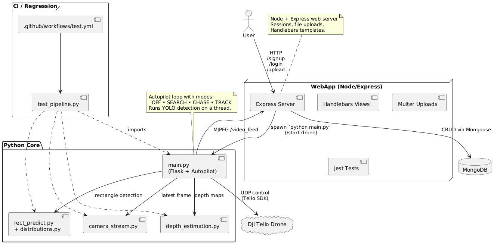

# DroneStrike

[Demo – Object Detection & Autonomous Chase](https://www.youtube.com/watch?v=RdNOznuV0Kg)

[Demo – Object Detection & Autonomous Chase POV2](https://www.youtube.com/watch?v=dXB14eVJF5E)

[Demo – Depth‑Aware Navigation](https://youtu.be/MrN-2Wlzxq8)


**DroneStrike** is an experimental end‑to‑end platform for **indoor drone navigation, object detection and depth‑aware obstacle avoidance** using an affordable DJI Tello.  
It bundles a Python computer‑vision stack (YOLO + MiDaS), a Node/Express web UI, and a GitHub Actions pipeline for automated offline testing.

---

## ✨ Key Features

* **Real‑time object detection** – YOLOv8 (any model size) running at ~20 FPS on GPU/CPU  
* **Autopilot modes** – “search” (spin) & “chase” (turn / ascend / descend towards person) with manual override at all times  
* **Depth estimation** – MiDaS DPT for dense depth maps converted to approximate metric units  
* **Door‑frame / rectangle finder** – Sobel‑style edge kernels + heuristic pairing to identify entrances in hallways  
* **Web dashboard** – Signup / login, live webcam preview, target‑image upload (MongoDB, Multer)  
* **CI pipeline** – GitHub Actions installs deps, runs regression tests on sample images/videos and stores processed outputs as artifacts  

---

## 📂 Repository Structure

```text
.
├── camera_stream.py        # Robust OpenCV VideoCapture wrapper
├── depth_estimation.py     # MiDaS initialisation & helpers
├── distributions.py        # Edge‑distribution utilities
├── main.py                 # ✈️ Flight loop + YOLO detections & HUD
├── rect_predict.py         # Rectangle (door) detector
├── test_pipeline.py        # Offline regression tests for CI
├── webapplication/         # Node + Express + HBS frontend
│   ├── public/             # – Static CSS/JS/assets
│   ├── src/                # – Routes, Mongo connection, multer config
│   └── templates/          # – Handlebars views
└── .github/workflows/      # GitHub Actions CI definition
```

---

## 🛠 Prerequisites

| Component | Version | Notes |
|-----------|---------|-------|
| Python    | 3.10+   | See `requirements.txt` |
| Node.js   | ≥ 18    | Needed for the web UI |
| MongoDB   | running locally on `mongodb://localhost:27017` | Change URI in `webapplication/src/mongodb.js` if different |
| DJI Tello | latest firmware | `djitellopy` handles connection |

---

## ⚡ Quick Start

```bash
# 1) Python backend (vision + flight)
python -m venv venv && source venv/bin/activate
pip install -r requirements.txt

# 2) Node/Express web app
cd webapplication
npm install
npm run start   # or nodemon for hot‑reload

# 3) Fly!
python main.py            # starts video stream & YOLO overlay
```

> **Tip:** you can switch between autonomous and manual control at any time: press **0** to toggle autopilot; use **W A S D I K J L** keys for fine manoeuvres; hit **Space / Esc** to land.

---

## 🧪 Running the Test Pipeline

The GitHub Actions workflow replicates the steps below:

```bash
mkdir -p output/images output/depth_images
python test_pipeline.py          # processes sample media in test_data/
```

Outputs (annotated images & depth maps) are stored in `output/` and exported as CI artifacts.

---

## 🚀 Roadmap

* Dockerised one‑shot deployment (Python & Node in a single compose stack)  
* SLAM‑based navigation & real‑time 3‑D occupancy grid  
* Target‑object training via few‑shot learning from user uploads  
* Optional ROS2 bridge for advanced research scenarios  

---

## 👥 Contributing

Pull requests are welcome! Feel free to open issues for feature suggestions or bug reports.  
Please run `black` / `isort` (Python) and `eslint` (Node) before submitting a PR.

---

## 📜 License

This project is released under the **MIT License** – see [LICENSE](LICENSE) for details.

---



## 📝 Backlog

You can track ongoing tasks, bugs, and feature planning on the DroneStrike Jira board:

[DroneStrike Backlog – Jira](https://dronestrike.atlassian.net/jira/software/projects/CCS/boards/1)
